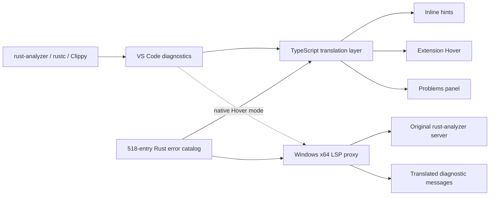

<p align="center">
  <h1 align="center">rust-analyzer-lingo</h1>
  <p align="center">
    A multilingual diagnostic companion for Rust in VS Code.
  </p>
  <p align="center">
    <a href="https://github.com/AreChen/rust-analyzer-lingo/actions/workflows/release.yml"></a>
    <a href="https://marketplace.visualstudio.com/">VS Code Extension</a>
    ·
    <a href="https://github.com/AreChen/rust-analyzer-lingo/issues">Issues</a>
    ·
    <a href="LICENSE">MIT License</a>
  </p>
  <p align="center">
    <a href="README.md"></a>
    <a href="docs/README.zh-CN.md"></a>
  </p>
</p>

`rust-analyzer-lingo` adds a readable, locale-ready layer on top of the Rust diagnostics already produced by `rust-analyzer`, `rustc`, and Clippy. The current catalog is written for Simplified Chinese; the extension architecture is intentionally prepared for English and additional languages.

## Highlights

- Translate Rust diagnostic codes and common compiler messages into concise, beginner-friendly explanations.
- Cover all 518 error-code pages shipped by the current stable Rust toolchain, including retired and compiler-internal entries with an explicit status message.
- Show translated diagnostics as inline hints, extension Hover content, or additional entries in the Problems panel.
- Preserve the original diagnostic, source range, severity, code, Rust keywords, identifiers, and code fragments.
- Replace native `rust-analyzer` diagnostic Hover content through a transparent Windows x64 LSP proxy when you want the original Hover surface translated too.
- Keep locale-specific content separate from the extension pipeline so future language packs can be added without rewriting the diagnostic transport layer.

## Requirements

- VS Code 1.90 or newer.
- The official [rust-analyzer extension](https://marketplace.visualstudio.com/items?itemName=rust-lang.rust-analyzer).
- A Rust toolchain with `rustc` and `cargo` available on your PATH.
- Native Hover replacement currently requires Windows x64. Inline hints, extension Hover, and Problems output do not require the native proxy.

## Install

### From a VSIX

Download or build a release VSIX, then install it from the VS Code command palette with **Extensions: Install from VSIX...**.

For a local package:

```powershell
code --install-extension .\rust-analyzer-lingo-0.1.0.vsix --force
```

### From source

```powershell
npm install
cargo build --release --manifest-path proxy\Cargo.toml
Copy-Item proxy\target\release\rust-analyzer-lingo-proxy.exe bin\rust-analyzer-lingo-proxy.exe -Force
npm run package
```

The generated VSIX is named `rust-analyzer-lingo-0.1.0.vsix`.

## Use it

Open a Rust file with a diagnostic. The default `inline` mode adds a compact translated hint at the end of the affected line. Hover the hint for the complete explanation; the original diagnostic remains available from `rust-analyzer` or `rustc`.

Choose a display mode with the `rust-analyzer-lingo.mode` setting:

| Mode | Behavior |
| --- | --- |
| `inline` | Add a compact translated hint beside the source line. |
| `hover` | Provide translated content through the extension's Hover provider. |
| `problems` | Add translated diagnostics to the Problems panel. |
| `both` | Enable translated Hover and Problems output together. |

Other settings:

| Setting | Default | Purpose |
| --- | --- | --- |
| `rust-analyzer-lingo.showFallback` | `false` | Show a generic explanation when a diagnostic has no catalog entry or message rule. |
| `rust-analyzer-lingo.inlineTextMaxLength` | `32` | Limit the visible inline hint length while keeping the full tooltip. |

The command palette also provides:

- **Rust Diagnostics: Explain Current Error** - Open the translated explanation for the diagnostic at the cursor.
- **Rust Diagnostics: Enable Native Chinese Hover Translation** - Route the bundled native `rust-analyzer` server through the Windows proxy.
- **Rust Diagnostics: Restore Native Hover** - Restore the server path and environment settings saved before proxy activation.

The native Hover command updates the selected workspace or global `rust-analyzer` settings and keeps a backup in the extension's global state. Restarting the Rust server may be required on older versions of the official `rust-analyzer` extension.

## Architecture



The TypeScript layer owns VS Code presentation and locale selection. The Rust proxy speaks standard LSP framing, forwards unrelated traffic unchanged, and rewrites diagnostic messages using the packaged catalog. The proxy discovers the real server through `RUST_ANALYZER_LINGO_REAL_SERVER`.

## Development

```powershell
npm install
npm run check
npm run compile
cargo check --manifest-path proxy\Cargo.toml
cargo build --release --manifest-path proxy\Cargo.toml
Copy-Item proxy\target\release\rust-analyzer-lingo-proxy.exe bin\rust-analyzer-lingo-proxy.exe -Force
npm run package
```

The error-code catalog lives in [`src/error-codes.ts`](src/error-codes.ts). Compare its keys with the `E*.html` files under the active Rust toolchain's `share/doc/rust/html/error_codes` directory whenever the Rust toolchain changes. Keep the catalog complete even when an entry is retired or no longer emitted.

Generated files such as `dist/`, `proxy/target/`, `node_modules/`, and VSIX packages are not source files and should not be committed.

## Build and release

GitHub Actions checks pull requests and pushes to `main` on a Windows x64 runner. It compiles the Rust proxy, runs the TypeScript check, builds the VSIX, and uploads the package as a workflow artifact. The workflow is defined in [`.github/workflows/release.yml`](.github/workflows/release.yml).

To publish a release, make the tag match the version in `package.json`, then push it:

```powershell
git tag v0.1.0
git push origin v0.1.0
```

A `v*` tag creates a GitHub Release automatically and attaches the generated VSIX. You can also run the workflow manually from the Actions tab; manual runs build and upload an artifact without creating a release.

## Roadmap

- Add a language selector and English locale without changing the diagnostic transport layer.
- Add more locale packs under `docs/` and the extension's translation resources.
- Provide native proxy builds for additional platforms.
- Expand contextual explanations while keeping inline output compact.

## Contributing

Bug reports and translation improvements are welcome. When submitting a catalog change, include the Rust error code, the source page or toolchain version used, and a short explanation of the chosen wording. Please run the TypeScript and Rust checks before opening a pull request.

## License

Released under the [MIT License](LICENSE).
