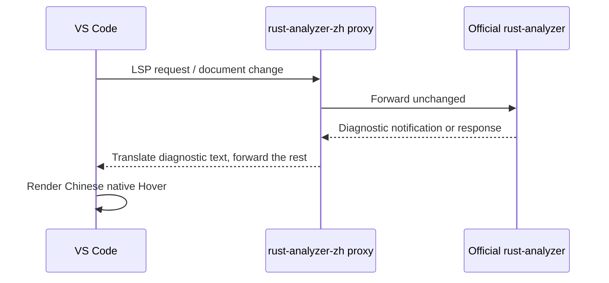

<div align="center">

# rust-analyzer-zh

**A multilingual-ready diagnostic experience for Rust in VS Code.**

Translate Rust compiler and `rust-analyzer` diagnostics into clear, practical Chinese—without changing the code you write.

<p>
  <a href="#english"><strong>English</strong></a>
  &nbsp;·&nbsp;
  <a href="#中文"><strong>中文</strong></a>
  &nbsp;·&nbsp;
  <a href="#roadmap"><strong>Roadmap</strong></a>
</p>


</div>

<a id="english"></a>

## English

> [!NOTE]
> The native diagnostic Hover replacement currently ships as a Windows x64 proxy. The regular inline translation features work without the proxy.

### What it does

`rust-analyzer-zh` is a VS Code extension for Rust learners and developers who want diagnostic explanations in Chinese while keeping Rust's original code terms, identifiers, and compiler locations intact.

It supports two complementary paths:

| Path | Result | Platform |
| --- | --- | --- |
| Extension diagnostics | Chinese inline hints, custom Hover cards, Problems entries, and an explanation command | VS Code platforms supported by the extension |
| Native Hover proxy | Translates diagnostics before the official `rust-analyzer` client renders its native Hover card | Windows x64 today |

### Highlights

- Chinese explanations for Rust compiler, `rust-analyzer`, and Clippy diagnostics.
- A catalog of 283 Rust error-code titles, including the 278 active codes found in the local stable Rust 1.96 index plus five common additions.
- Compact inline hints that keep the editor readable; long explanations stay in the Hover tooltip.
- Optional native Hover translation through an LSP proxy, including related messages such as `expected ... found ...`, `add ... here`, and `original diagnostic`.
- A safe enable/restore flow that remembers the previous `rust-analyzer.server.path` and `rust-analyzer.server.extraEnv` settings.
- A language-navigation layout that can grow from English and Chinese to more locales later.

### Quick start

#### Install the extension

If you are using a packaged VSIX:

```powershell
code --install-extension .\rust-analyzer-zh-0.0.4.vsix --force
```

Also install and enable the official [`rust-analyzer`](https://marketplace.visualstudio.com/items?itemName=rust-lang.rust-analyzer) extension.

#### Enable native Chinese Hover

Open a Rust file, press `Ctrl+Shift+P`, and run:

```text
Rust 中文诊断：启用原生 Hover 中文替换
```

The extension saves the current rust-analyzer server settings, points the official client at the bundled proxy, and restarts the server. Hover a red diagnostic underline to see the translated native card.

To restore the official server:

```text
Rust 中文诊断：恢复原生 Hover
```

#### Configure the extension

```json
{
  "rust-analyzer-zh.mode": "inline",
  "rust-analyzer-zh.showFallback": false,
  "rust-analyzer-zh.inlineTextMaxLength": 32
}
```

| Setting | Values | Default | Purpose |
| --- | --- | --- | --- |
| `rust-analyzer-zh.mode` | `inline`, `hover`, `problems`, `both` | `inline` | Choose where extension-generated Chinese diagnostics appear. |
| `rust-analyzer-zh.showFallback` | `true` / `false` | `false` | Show a generic Chinese explanation for uncatalogued diagnostics. |
| `rust-analyzer-zh.inlineTextMaxLength` | integer ≥ 8 | `32` | Limit inline hint width while keeping the full tooltip available. |

### How it works

The extension layer reads diagnostics exposed by VS Code and creates its own Chinese presentation. The optional proxy sits between the official language client and the real `rust-analyzer` executable; non-diagnostic LSP messages are forwarded unchanged.



The proxy keeps code snippets and source locations useful for debugging. Rust keywords, type names such as `i32`, identifiers, and code fragments remain unchanged because translating them would make the diagnostic harder to match to the source.

### Development

Prerequisites:

- Node.js and npm
- Rust and Cargo
- VS Code 1.90 or newer
- The official `rust-analyzer` extension for end-to-end testing

Install dependencies and run the checks:

```powershell
npm install
npm run check
npm run compile
cargo check --manifest-path proxy/Cargo.toml
```

Build the Windows x64 proxy and package the extension:

```powershell
cargo build --release --manifest-path proxy/Cargo.toml
Copy-Item proxy/target/release/rust-analyzer-zh-proxy.exe bin/rust-analyzer-zh-proxy.exe -Force
npm run package
```

Press `F5` in VS Code to launch the configured Extension Development Host. The proxy is intentionally packaged as a platform-specific binary for now; the extension layer remains useful on other platforms.

### Project layout

| Path | Responsibility |
| --- | --- |
| `src/extension.ts` | VS Code activation, diagnostics collection, inline hints, Hover provider, commands, and settings. |
| `src/translation.ts` | Diagnostic-code and message translation logic. |
| `src/error-codes.ts` | Rust error-code title catalog. |
| `proxy/src/main.rs` | JSON-RPC/LSP proxy that translates native diagnostics. |
| `bin/rust-analyzer-zh-proxy.exe` | Packaged Windows x64 proxy binary. |
| `package.json` | VS Code manifest, commands, settings, and npm scripts. |
| `AGENTS.md` | Repository guidance for future coding agents. |

### Roadmap

<a id="roadmap"></a>

- Add a locale-neutral diagnostic model shared by every presentation layer.
- Add English, Simplified Chinese, and additional language packs without duplicating translation logic.
- Support portable native proxies for Linux, macOS, remote development, and WSL.
- Expand explanations from short titles to structured beginner-friendly guidance.
- Add automated fixture coverage for common Rust compiler and `rust-analyzer` diagnostics.

### Contributing

Keep translation output short enough for an editor, preserve source locations and code snippets, and add a focused fixture when changing the proxy or a common diagnostic rule. Run the TypeScript and Rust checks before packaging.

### License

MIT. See [`LICENSE`](LICENSE).

<a id="中文"></a>

## 中文

### 项目简介

`rust-analyzer-zh` 是一个 VS Code Rust 诊断扩展，主要面向中文 Rust 学习者。它把 Rust 编译器、`rust-analyzer` 和 Clippy 的错误提示转换成易懂的中文，同时保留关键字、类型名、变量名和代码位置，方便回到源代码中定位问题。

项目分为两层：

- 扩展层：提供行内中文提示、自定义 Hover、Problems 面板诊断和“解释当前错误”命令。
- 原生 Hover 代理：在官方 `rust-analyzer` 把诊断交给 VS Code 之前翻译文本，让原生错误卡片也能显示中文。目前代理提供 Windows x64 版本。

### 快速开始

安装 VSIX 后打开 Rust 文件，按 `Ctrl+Shift+P`，执行：

```text
Rust 中文诊断：启用原生 Hover 中文替换
```

扩展会保存原来的 rust-analyzer 服务器配置，切换到内置代理并重启服务器。要恢复官方服务器，执行：

```text
Rust 中文诊断：恢复原生 Hover
```

### 开发命令

```powershell
npm install
npm run check
npm run compile
cargo check --manifest-path proxy/Cargo.toml
cargo build --release --manifest-path proxy/Cargo.toml
Copy-Item proxy/target/release/rust-analyzer-zh-proxy.exe bin/rust-analyzer-zh-proxy.exe -Force
npm run package
```

### 词典与未来多语言

当前错误代码词典包含 283 项。README 顶部的语言导航已经按多语言扩展预留，后续可以增加更多语言，而不改变 Rust 代码和诊断位置的展示方式。

返回顶部：<a href="#english"><strong>English</strong></a> · <a href="#roadmap"><strong>Roadmap</strong></a>
