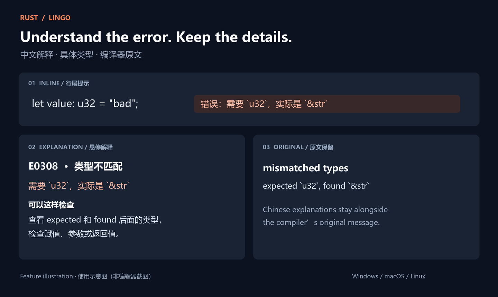

# Rust diagnostic explanations · Lingo

Read Rust errors and warnings in Simplified Chinese, with the original compiler details one hover away.

[简体中文使用说明](docs/README.zh-CN.md) · [Changelog](CHANGELOG.md) · [Support](SUPPORT.md)

An independent companion to the official rust-analyzer extension. This project is not affiliated with the Rust or rust-analyzer teams.



*Feature illustration, not an editor screenshot.*

## Start using it

1. Install the official [rust-analyzer extension](https://marketplace.visualstudio.com/items?itemName=rust-lang.rust-analyzer) and a Rust toolchain.
2. Install **Rust 中文诊断 · Lingo**, extension ID `rust-analyzer-lingo.rust-analyzer-lingo`. For manual installation, download the [release VSIX](https://github.com/AreChen/rust-analyzer-lingo/releases/latest) matching the extension host platform and use **Extensions: Install from VSIX...**.
3. Open a Rust project. A short Chinese explanation appears at the end of a line with a supported diagnostic. Hover it for details.
4. Click **Rust 中文** in the status bar to change the display mode or explain the problem at the cursor.

Requires VS Code 1.90 or newer. Inline hints, extension hovers, and the Problems panel do not require the native proxy. Native diagnostic translation currently supports **Windows, macOS and Linux on x64 / ARM64**, including Alpine Linux and requires a trusted workspace.

The extension currently translates into Simplified Chinese. Additional languages are not yet implemented.

## Understand a diagnostic

Given `expected u32, found &str`, the hint identifies both types instead of only saying “type mismatch”. The detail card contains:

- Severity and error code.
- A short explanation with concrete types or names where recognized.
- A practical next step.
- The original compiler message, related locations, and an official Rust error-code link when available.

When several diagnostics share a line, the most severe one appears first and the hint shows how many others are available. Different diagnostics remain available in the detail card. The status-bar counts cover diagnostics with displayed translations.

## Choose where explanations appear

Use the status-bar menu or **Rust 中文诊断：切换显示方式**.

| Mode | What you see |
| --- | --- |
| `inline` (default) | A compact hint at the line end; hover the hint for details. |
| `hover` | Chinese explanations when hovering the diagnostic range. |
| `problems` | Additional Chinese entries in Problems. The original entries remain. |
| `both` | Extension hovers and additional Problems entries. |

`rust-analyzer-lingo.inlineTextMaxLength` limits the summary to 32 characters by default; severity and the additional-diagnostic count appear separately. `rust-analyzer-lingo.showFallback` controls generic hints for unsupported diagnostics and defaults to `false`. The **Explain current problem** command still shows an unsupported diagnostic's original text.

## Translate the original diagnostic surface

In a supported, trusted workspace, choose **Rust 中文诊断：在原始诊断中显示中文**. This translates diagnostic messages coming from the original server, including their appearance in Problems and native diagnostic hovers. It is separate from the four display modes above.

Recognized diagnostics include a Chinese summary and the exact original message. Unknown messages remain unchanged. Source, severity, ranges, codes, documentation links, and opaque LSP `data` are preserved. Ordinary symbol documentation, completion, code actions, and other unrelated LSP message bodies are forwarded unchanged.

The command uses your existing custom `rust-analyzer.server.path` when set. Otherwise it checks project toolchain overrides declaring the `rust-analyzer` component, then uses the installed official extension's bundled server. Numeric and `null` values in `server.extraEnv` are supported. It validates the selected server before changing settings.

Settings are saved per workspace and configuration scope. **Rust 中文诊断：恢复原始诊断** restores the saved settings while retaining edits you made after enabling the proxy. New activations only modify workspace/folder settings, not global settings. `diagnostics.useRustcErrorCode` is no longer modified.

After an extension or official-server update, an existing managed connection is checked on activation. Proxy binaries live in extension storage so removing an old extension directory does not immediately break the configured executable path. User-modified connection settings are not overwritten by this check.

### Upgrading from 0.1.x

The old release stored one backup shared by all projects. Its owner cannot be reconstructed reliably. If the extension detects an old proxy path, run **恢复原始诊断**, verify the displayed previous server path, and confirm only if that backup belongs to your setup. Then enable translation again. An old global configuration is changed only after this explicit confirmation. The legacy backup is retained because another workspace may still need it.

## Build and verify

With Node.js 22+ and stable Rust installed:

```powershell
rtk npm ci
rtk npm run check
rtk npm test
rtk cargo test --manifest-path proxy/Cargo.toml
rtk npm run check:catalog
rtk npm run package
```

Packaging rebuilds the host-platform Rust proxy into `out/bin/`, compiles TypeScript and the shared catalog into `out/dist/`, and creates `out/packages/rust-analyzer-lingo-0.3.1-<platform>.vsix`. It checks that the TypeScript and Rust package versions agree. No manual executable copy is needed.

The regression suite covers configuration restoration, translation context, unknown diagnostics, framing, progress reports, process cleanup, and unchanged non-diagnostic traffic. The catalog checker compares all `E####.html` pages in the local stable toolchain with the source catalog, including retired entries.

A real-server smoke test verifies diagnostics, hover, completion, code actions, and shutdown:

```powershell
$server = 'C:\path\to\rust-analyzer.exe'
$proxy = Join-Path $PWD 'out/bin/rust-analyzer-lingo-proxy.exe'
rtk proxy node scripts/smoke-lsp.cjs $server $proxy
```

`scripts/test-vscode.cjs` launches an isolated VS Code profile with the official extension directory passed as its argument (requires VS Code and RTK on PATH). For example: `rtk proxy node scripts/test-vscode.cjs C:/path/to/rust-lang.rust-analyzer-version`.

`test/extension-host.cjs` is the actual VS Code extension-host suite. Run it with `--extensionDevelopmentPath` and `--extensionTestsPath` in an isolated `--user-data-dir` and test workspace, with the official extension installed there. It edits only that test workspace's settings and verifies presentation modes and native enable/restore.

Compatibility verified for this release: official extension/server **0.3.3033** and **0.3.3041**, including an extension-host run with 0.3.3041. The [2026-09-07 official release](https://github.com/rust-lang/rust-analyzer/releases/tag/2026-09-07) adds missing-body diagnostics, which are covered by the shared message rules. Future unknown messages remain readable in their original form; future versions still need compatibility testing.

## Platform packages and output directories

| Environment | VSIX target |
| --- | --- |
| Windows Intel/AMD / ARM64 | `win32-x64` / `win32-arm64` |
| macOS Intel / Apple Silicon | `darwin-x64` / `darwin-arm64` |
| Linux GNU x64 / ARM64 | `linux-x64` / `linux-arm64` |
| Alpine Linux x64 / ARM64 | `alpine-x64` / `alpine-arm64` |

For SSH, WSL, or containers, choose the remote extension host's platform. GNU Linux packages are built on Ubuntu 22.04; Alpine proxies use static musl. This release does not target 32-bit ARM, 32-bit Windows, or the browser. Unix executable permissions are set when activating the proxy.

`src/`, `proxy/src/`, `scripts/`, and `test/` contain maintained source. `out/dist/` contains compiled JavaScript and JSON; `out/bin/` contains the native executable; `out/packages/` contains installable VSIX packages. `node_modules/` and `proxy/target/` retain their standard dependency/cache locations. None of these generated directories belong in Git.

CI builds and tests all eight targets on native x64 / ARM64 runners (musl targets use the corresponding Linux runner). It tests the release binary and checks each VSIX's contents and platform metadata. The release job waits for the complete matrix, verifies all eight filenames, and publishes the packages with SHA-256 checksums. The pinned official-server smoke test runs on Windows x64; full GUI extension-host checks on other systems are not yet automated.

`VSCE_TARGET` selects a target for build/package scripts. Cross-compilation requires the matching Rust target and linker; changing this variable alone does not install them. Local packaging defaults to the current platform.

## Maintain the extension

- `src/extension.ts`: presentation, menu, status bar, and batched diagnostic refresh.
- `src/native.ts`: scoped configuration backups, server discovery, validation, and restore.
- `src/error-codes.ts`: 518 Rust error-code titles from the verified local stable toolchain.
- `src/diagnostic-details.json` and `src/message-rules.json`: shared explanations and message rules.
- `scripts/build-catalog.cjs`: generates `out/dist/catalog.json` for the Rust proxy. The proxy does not parse JavaScript.
- `proxy/src/`: LSP transport and contextual native translation.
- `.github/workflows/release.yml`: regression tests, a pinned real-server smoke test, VSIX content checks, and tag-based releases.

To release, match the Git tag to `package.json` and `proxy/Cargo.toml` (for example `v0.3.1`). CI validates the tag, attaches the eight VSIX packages to a GitHub Release, and dispatches **Sync VS Code Marketplace**. Once its workload identity is configured, that workflow validates and uploads the same packages to Marketplace, skipping platform versions already published. See [publishing setup, dry runs and retries](docs/marketplace-publishing.md). Generated dependencies, `out/`, `proxy/target/`, and VSIX files are not source files. Native binaries are built by CI and are not tracked in Git.

[Report a problem](https://github.com/AreChen/rust-analyzer-lingo/issues). Include the extension and rust-analyzer versions, display mode, original diagnostic, and a small Rust example when possible.

## License

[MIT](LICENSE).
